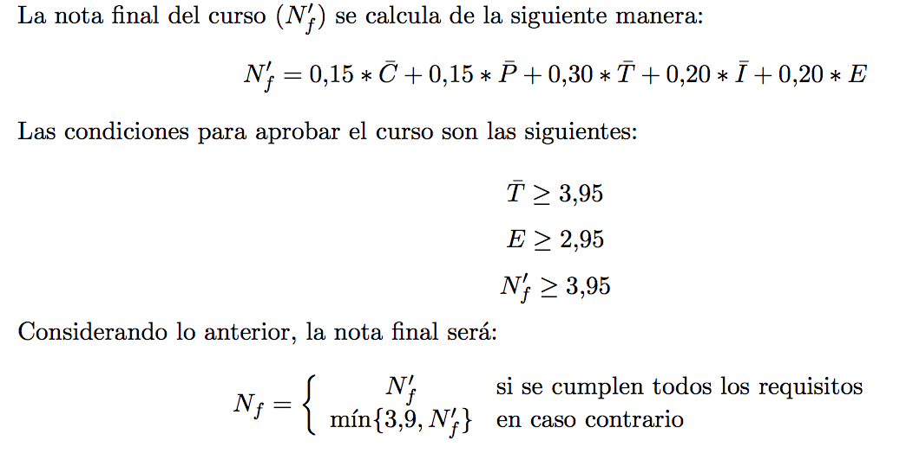

# IIC2113 — Diseño Detallado de Software

## Tabla de contenidos

- [Extracto del programa del curso](#extracto-del-programa-del-curso)
  - [Equipo](#equipo)
    - [Profesor](#profesor)
    - [Ayudantes](#ayudantes)
  - [Objetivos](#objetivos)
  - [Contenidos](#contenidos)
  - [Evaluación](#evaluación)
- [Foro](#foro)
- [Política de integridad académica](#política-de-integridad-académica)

---

# Extracto del programa del curso

## Equipo

### Profesor

Nombre         | Sección | GitHub      | Email
-------------- | ------- | ----------- | ---------------------
Rodrigo Saffie | 1       | [@rasaffie] | [rasaffie@ing.puc.cl]

### Ayudantes

Nombre           | GitHub        | Email
---------------- | ------------- | ----------------
Nebil Kawas      | [@nkawasg]    | [nakawas@uc.cl]
Patricio López   | [@mrpatiwi]   | [pelopez2@uc.cl]
Sebastián Salata | [@sasalatart] | [sasalata@uc.cl]

[@rasaffie]:   https://github.com/rasaffie
[@nkawasg]:    https://github.com/nkawasg
[@mrpatiwi]:   https://github.com/mrpatiwi
[@sasalatart]: https://github.com/sasalatart

[rasaffie@ing.puc.cl]: mailto:rasaffie@ing.puc.cl
[nakawas@uc.cl]:       mailto:nakawas@uc.cl
[pelopez2@uc.cl]:      mailto:pelopez2@uc.cl
[sasalata@uc.cl]:      mailto:sasalata@uc.cl

## Objetivos
- Realizar diseño y programación orientados a objetos con pericia
- Evaluar la calidad de un diseño, utilizando criterios teóricos y prácticos
- Analizar software para mejorar su eficiencia, confiabilidad, y mantenibilidad
- Usar patrones de diseño en el diseño de software

## Contenidos
- Introducción
  - ¿Qué es el diseño detallado de software?
  - Modelo 4+1
- Principios del diseño detallado de software
  - Cohesión
  - Acomplamiento
  - Abstracción
  - Ocultamiento
  - SOLID
- Diseño detallado aplicado a componentes
  - Patrones de diseño
  - _Frameworks_
- _Testing_ y _refactoring_
  - Técnicas de _testing_
  - _Code smells_
  - Técnicas de _refactoring_
  - Métricas de calidad de código
- Ingeniería reversa

## Evaluación

### Controles

El curso contará con controles (_C_) periódicos sobre los contenidos del curso y/o lecturas.

### Presentaciones

Los alumnos del curso deberá realizar 1 presentación (_P_) sobre distintos temas relacionados con los contenidos del curso. Los temas a investigar serán anunciados con anticipación.

Las presentaciones serán en horario de clases, en la siguiente fecha:

Presentación     | ¿Cuándo?
---------------- | ----------------------
Presentación | martes 08 de noviembre

### Tareas

El curso contará con 3 tareas (_T_) a lo largo del semestre. Las fechas de publicación de los enunciados y entrega de las tareas son:

Tarea     | Publicación             | Entrega
--------- | ----------------------- | ------------------------
Tarea \#1 | jueves 25 de agosto     | domingo 11 de septiembre
Tarea \#2 | jueves 29 de septiembre | viernes 14 de octubre
Tarea \#3 | jueves 27 de octubre    | viernes 11 de noviembre

### Interrogaciones

El curso contará con 2 interrogaciones (_I_) a lo largo del semestre. Estas serán en horario de clases en las siguientes fechas:

Interrogación     | ¿Cuándo?
----------------- | -----------------------
Interrogación \#1 | martes 13 de septiembre
Interrogación \#2 | martes 25 de octubre

### Examen

El curso contará con un examen (_E_) obligatorio.

**La fecha del examen es el viernes 25 de noviembre, a las 08:30.**

# Foro

La página de [_issues_](https://github.com/IIC2113-2016-2/syllabus/issues) se utilizará como foro para preguntas.

> Si no lo has usado antes, revisa [este _issue_](
  https://github.com/IIC2113-2016-2/syllabus/issues/1).

# Política de integridad académica

Los alumnos de la Escuela de Ingeniería de la Pontificia Universidad Católica de Chile deben mantener un comportamiento acorde a la Declaración de Principios de la Universidad.  En particular, se espera que **mantengan altos estándares de honestidad académica**.  Cualquier acto deshonesto o fraude académico está prohibido; los alumnos que incurran en este tipo de acciones se exponen a un Procedimiento Sumario. Es responsabilidad de cada alumno conocer y respetar el documento sobre Integridad Académica publicado por la Dirección de Docencia de la Escuela de Ingeniería (disponible en SIDING).

Específicamente, para los cursos del Departamento de Ciencia de la Computación, rige obligatoriamente la siguiente política de integridad académica. Todo trabajo presentado por un alumno para los efectos de la evaluación de un curso debe ser hecho individualmente por el alumno, sin apoyo en material de terceros.  Por _trabajo_ se entiende en general las interrogaciones escritas, las tareas de programación u otras, los trabajos de laboratorio, los proyectos, el examen, entre otros.

**En particular, si un alumno copia un trabajo, o si a un alumno se le prueba que compró o intentó comprar un trabajo, obtendrá nota final 1.1 en el curso y se solicitará a la Dirección de Docencia de la Escuela de Ingeniería que no le permita retirar el curso de la carga académica semestral.**

Por _copia_ se entiende incluir en el trabajo presentado como propio, partes hechas por otra persona.  **En caso que corresponda a _copia_ a otros alumnos, la sanción anterior se aplicará a todos los involucrados**.  En todos los casos, se informará a la Dirección de Docencia de la Escuela de Ingeniería para que tome sanciones adicionales si lo estima conveniente.

Obviamente, está permitido usar material disponible públicamente, por ejemplo, libros o contenidos tomados de Internet, siempre y cuando se incluya la referencia correspondiente.

Lo anterior se entiende como complemento al [Reglamento del Alumno de la Pontificia Universidad Católica de Chile].  Por ello, es posible pedir a la Universidad la aplicación de sanciones adicionales especificadas en dicho reglamento.

[Reglamento del Alumno de la Pontificia Universidad Católica de Chile]: http://admisionyregistros.uc.cl/alumnos/informacion-academica/reglamentos-estudiantiles
